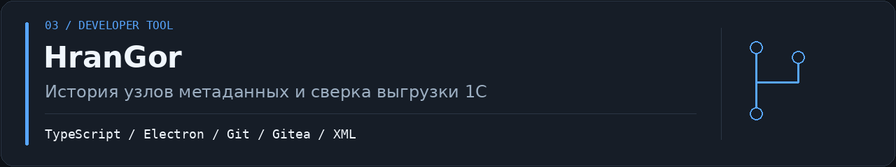

  

# HranGor

Windows-приложение для исследования конфигураций 1С через историю Git/Gitea. HranGor строит дерево метаданных и показывает, кто, когда и что менял в каждом объекте, реквизите, форме и модуле.

**[Скачать HranGor для Windows](https://github.com/butvinskiyvsr-cmyk/hrangor-releases/releases/latest/download/HranGor-Setup-0.4.0.exe)** · [Все релизы](https://github.com/butvinskiyvsr-cmyk/hrangor-releases/releases)

Исходный код хранится в отдельном закрытом репозитории. Здесь публикуются официальные установщики и файлы автоматического обновления.

## Возможности

- дерево метаданных конфигурации 1С из Git/Gitea;
- история изменений выбранного узла с автором и временем;
- просмотр различий для содержательных изменений;
- сверка локальной XML-выгрузки с серверной историей;
- отделение форматных изменений XML от значимых правок;
- фоновая проверка и установка новых версий.

## Требования

- Windows x64;
- установленный [Git for Windows](https://git-scm.com/download/win);
- доступ к нужному серверу Gitea или Git-репозиторию;
- права на чтение анализируемого репозитория.

## Установка

1. Откройте [последний релиз](../../releases/latest).
2. Скачайте `HranGor-Setup-<версия>.exe`.
3. Запустите установщик. Права администратора не требуются: приложение устанавливается в профиль пользователя.
4. При первом запуске укажите репозиторий и дождитесь первичной загрузки истории. Последующие синхронизации получают только новые изменения.

Файлы `latest.yml` и `*.blockmap` обслуживают автоматическое обновление — вручную их скачивать не нужно.

## Обновления

HranGor проверяет этот репозиторий при запуске и затем каждые четыре часа. Новая версия загружается в фоне, после чего приложение предлагает перезапуск.

Установщик пока не подписан сертификатом издателя. Windows может показать предупреждение SmartScreen; убедитесь, что файл загружен именно из [официальных релизов](../../releases), прежде чем продолжать установку.

## Обратная связь

Сообщить об ошибке можно через [Issues](../../issues). Приложите шаги воспроизведения и сведения о версии, но не публикуйте токены, внутренние адреса, имена сотрудников и реальные данные конфигурации.
